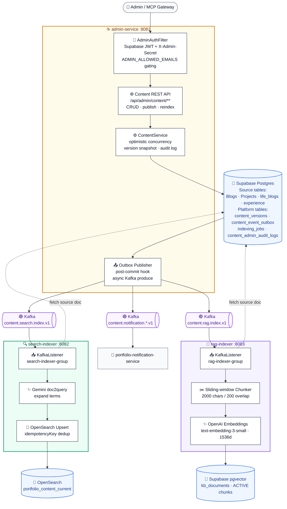

# portfolio-admin-service

Admin content platform behind [yuqi.site](https://www.yuqi.site). Owns the
**write side** of the portfolio (Blogs, Projects, life_blogs, experience),
plus the workers that fan published content out to **OpenSearch** (full-text
search) and **pgvector** (RAG embeddings via OpenAI).

This is a multi-module Maven repo containing three independently-deployed
Spring Boot services that share a Supabase Postgres database and communicate
only over Kafka — no inter-service HTTP.

---

## Architecture



**Design properties:**

1. **Transactional outbox.** `admin-service` never publishes to Kafka inside a
   DB transaction. Each publish writes `content_versions` +
   `content_event_outbox` + `indexing_jobs` atomically, then a post-commit
   hook fires Kafka asynchronously. If Kafka is down the rows stay
   `PENDING` and a re-publisher (TODO) drains them.
2. **One consumer group per worker.** `search-indexer-group` and
   `rag-indexer-group` consume independently — a slow OpenAI call in the
   RAG worker cannot delay search indexing.
3. **At-least-once + idempotency key.** Each event carries
   `idempotencyKey = "{jobType}:{sourceType}:{sourceId}:v{version}"`.
   Both workers upsert by key, so replay is safe.
4. **Hibernate `ddl-auto: none`.** This service does NOT own the existing
   Supabase tables (`"Blogs"`, `"Projects"`, …). It owns only its own
   admin-platform tables, managed by Flyway. Schema validation is off so
   sharing the database with the Next.js portfolio app is safe.

---

## Repository layout

| Module                         | Port | Container image (Artifact Registry)                                                |
|--------------------------------|------|------------------------------------------------------------------------------------|
| `admin-service/`               | 8081 | `us-central1-docker.pkg.dev/portfolio-notify-prod/portfolio/portfolio-admin-service` |
| `search-indexer/`              | 8082 | `…/portfolio-search-indexer`                                                       |
| `rag-indexer/`                 | 8083 | `…/portfolio-rag-indexer`                                                          |

All three services are built from this monorepo by their own GitHub Actions
workflow under `.github/workflows/deploy-*.yml`. Each builds only its
module via `mvn -pl <module> -am package` and pushes its own image.

```
.
├── admin-service/             Write API + outbox + Flyway migrations
│   ├── src/main/java/site/yuqi/admin/
│   │   ├── controller/        REST endpoints (/api/admin/**)
│   │   ├── service/           ContentService, OutboxService, IndexingJobService, AuditLogService
│   │   ├── domain/            JPA entities (admin-owned tables)
│   │   ├── domain/source/     Read adapters for shared tables (Blog, Project, LifeBlog, Experience)
│   │   ├── events/            ContentIndexEvent, ContentPublishedEvent + publishers
│   │   ├── security/          AdminAuthFilter (X-Admin-Secret + Supabase JWT)
│   │   └── adapter/           NormalizedContent + per-source normalizers
│   └── src/main/resources/db/migration/V1__admin_content_platform.sql
├── search-indexer/            Kafka → OpenSearch upserts
│   └── src/main/java/site/yuqi/searchindexer/
│       ├── kafka/             @KafkaListener for content.search.index.v1
│       ├── config/            KafkaConsumerConfig (ErrorHandlingDeserializer)
│       └── opensearch/        Aiven OpenSearch REST client
├── rag-indexer/               Kafka → OpenAI embeddings → pgvector
│   └── src/main/java/site/yuqi/ragindexer/
│       ├── kafka/             @KafkaListener for content.rag.index.v1
│       ├── chunk/             Sliding-window chunker (2000 chars / 200 overlap)
│       └── embed/             OpenAI embeddings client + kb_documents writer
└── .github/workflows/
    ├── deploy-admin-service.yml
    ├── deploy-search-indexer.yml
    └── deploy-rag-indexer.yml
```

---

## Tables owned by this service

Flyway in `admin-service` manages **only** these tables. Everything else in
`public` is owned by the Next.js portfolio or by notification-service.

| Table                         | Purpose                                                          |
|-------------------------------|------------------------------------------------------------------|
| `content_versions`            | Immutable snapshot per publish (`source_type`, `source_id`, `version`, `snapshot jsonb`) |
| `content_event_outbox`        | Transactional outbox; one row per publish; status `PENDING → SENT / FAILED` |
| `indexing_jobs`               | One row per (source × jobType × version); workers transition `PENDING → RUNNING → DONE / FAILED` |
| `content_admin_audit_logs`    | Append-only audit (`CREATE`, `UPDATE`, `PUBLISH`, `REINDEX`)     |
| `kb_documents`                | RAG chunks with `embedding vector(1536)`, `metadata jsonb`       |

Source-of-truth tables (read by admin-service, **never schema-migrated by it**):
`public."Blogs"`, `public."Projects"`, `public.life_blogs`,
`public.experience`. Case-sensitive identifiers are preserved via
`spring.jpa.properties.hibernate.physical_naming_strategy =
PhysicalNamingStrategyStandardImpl`.

---

## Event contracts

### `ContentIndexEvent` (search + RAG)

Published by `admin-service`, consumed by both indexers.

```json
{
  "eventId":        "uuid",
  "occurredAt":     "2026-06-21T05:00:00Z",
  "sourceType":     "BLOG | PROJECT | LIFE_BLOG | EXPERIENCE",
  "sourceId":       "uuid-or-bigint-as-text",
  "sourceVersion":  3,
  "indexingJobId":  "uuid",
  "idempotencyKey": "SEARCH_INDEX:BLOG:<id>:v3",
  "jobType":        "SEARCH_INDEX | RAG_INDEX"
}
```

**Kafka key** = `sourceType:sourceId` → guarantees in-order processing of
all versions of the same content within one partition.

### `ContentPublishedEvent` (notifications)

Published by `admin-service`, consumed by **portfolio-notification-service**.

| `sourceType`               | Target Kafka topic                                |
|----------------------------|---------------------------------------------------|
| `BLOG`, `LIFE_BLOG`        | `content.notification.article-updates.v1`         |
| `PROJECT`                  | `content.notification.feature-updates.v1`         |
| `EXPERIENCE`               | `content.notification.job-updates.v1`             |

(notification-service currently subscribes to a legacy
`portfolio.content-events` topic; the migration to subscribe directly to the
three `content.notification.*.v1` topics is tracked in that repo.)

---

## REST API (admin-service)

**Dual auth channel** — pick the credential that fits your caller:

| Channel | Header | Used by | Status |
|---------|--------|---------|--------|
| **Primary (browser)** | `Authorization: Bearer <Supabase JWT>` | Portfolio admin panel (`/admin/*` pages) and Mr. Pot chat widget. Sign in at <https://www.yuqi.site> → the JWT is `(await supabase.auth.getSession()).data.session.access_token`. Email must be in `ADMIN_ALLOWED_EMAILS`. | Preferred |
| **Fallback (server-to-server)** | `X-Admin-Secret: <secret>` | Internal scripts, CI smoke tests, server-side jobs. Value must equal the `ADMIN_SECRET` env var. | Use only when a JWT is not available |

Error responses use the structured `ApiError` shape so the frontend can react:

| Status | `error` code | Meaning |
|--------|--------------|---------|
| 401    | `missing_credentials` | Neither header supplied → UI should redirect to the Portfolio Supabase login. |
| 401    | `invalid_token`       | Bearer JWT failed signature/expiry, or `X-Admin-Secret` mismatched → UI should clear the session and re-prompt. |
| 403    | `forbidden_email`     | JWT was valid but email is not in `ADMIN_ALLOWED_EMAILS` → UI should show "your account is not authorised". |

**Swagger UI** at `/swagger-ui.html` is whitelisted (no filter) so humans can
log in there: click **Authorize**, pick `BearerAuth`, paste `Bearer <token>`.

### Where these endpoints surface in the Portfolio

| Admin feature              | Portfolio admin page              | Chat widget MCP tool (Mr. Pot)        |
|----------------------------|-----------------------------------|---------------------------------------|
| List / create / update blog content | `/admin/blogs`, `/admin/blogs/new`, `/admin/blogs/[id]` | `content.list`, `content.create`, `content.update` |
| List / edit life blogs     | `/admin/life-blogs/*`             | `content.list`, `content.update` |
| List / edit projects       | `/admin/projects/*`               | `content.list`, `content.update` |
| Publish + emit content event | (publish button on editor pages) | `content.publish` |
| Re-index a doc (RAG / search) | (re-index button on editor pages) | `content.reindex` |
| Inspect indexing jobs      | `/admin` quick-action card → admin-service Swagger | `job.list`, `job.retry` |
| Inspect outbox events      | (Swagger UI)                      | `outbox.list` |
| Audit log                  | (Swagger UI)                      | `audit.list` |

| Method | Path                                                              | Purpose                                                              |
|--------|-------------------------------------------------------------------|----------------------------------------------------------------------|
| GET    | `/api/admin/content`                                              | List across one or all sources                                       |
| GET    | `/api/admin/content/{sourceType}/{sourceId}`                      | Detail + latest version + recent jobs + audit logs                   |
| POST   | `/api/admin/content/{sourceType}`                                 | Create (optionally publish)                                          |
| PUT    | `/api/admin/content/{sourceType}/{sourceId}`                      | Update                                                               |
| POST   | `/api/admin/content/{sourceType}/{sourceId}/publish`              | Snapshot + outbox + RAG/SEARCH jobs + audit, atomic                  |
| POST   | `/api/admin/content/{sourceType}/{sourceId}/reindex-rag`          | Force a RAG re-index                                                 |
| POST   | `/api/admin/content/{sourceType}/{sourceId}/reindex-search`       | Force a Search re-index                                              |
| GET    | `/api/admin/indexing-jobs`                                        | List jobs (`?status=FAILED&jobType=RAG_INDEX`)                       |
| POST   | `/api/admin/indexing-jobs/{jobId}/retry`                          | Retry FAILED / SKIPPED job                                           |
| GET    | `/api/admin/outbox-events`                                        | Inspect outbox for debugging                                         |
| GET    | `/actuator/health`                                                | Liveness, no auth                                                    |
| GET    | `/swagger-ui.html`                                                | OpenAPI docs                                                         |

---

## Runtime topology (production)

| Concern          | Choice                                                                                   |
|------------------|------------------------------------------------------------------------------------------|
| Compute          | Cloud Run (managed), region `us-central1`, GCP project `portfolio-notify-prod`           |
| Image registry   | Artifact Registry `us-central1-docker.pkg.dev/portfolio-notify-prod/portfolio`           |
| Auth (CI)        | GitHub OIDC → Workload Identity Federation (no JSON keys)                                |
| CI service account | `ci-deployer@portfolio-notify-prod.iam.gserviceaccount.com`                            |
| Runtime SA       | `admin-platform-runtime@portfolio-notify-prod.iam.gserviceaccount.com`                   |
| Secrets          | Google Secret Manager, mounted as env vars via `--update-secrets`                        |
| Database         | Supabase Postgres 15 (`db.<ref>.supabase.co:5432`, `sslmode=require`)                    |
| Bus              | Aiven Kafka (`SASL_SSL` + `SCRAM-SHA-256`, PEM CA in `KAFKA_CA_CERT`)                    |
| Search           | Aiven OpenSearch                                                                          |
| Embeddings       | OpenAI `text-embedding-3-small` (1536 dims)                                              |

### Networking gotcha — Supabase is IPv6-only

`db.*.supabase.co` (free tier) publishes **only** an `AAAA` record. The JVM
must not be forced onto the IPv4 stack:

```dockerfile
ENV JAVA_OPTS="-XX:+UseG1GC -XX:MaxRAMPercentage=75 -Djava.net.preferIPv6Addresses=true"
```

Local Macs work either way because of NAT64; Cloud Run does not.

---

## Configuration

All three services share these env vars (set via Cloud Run `--set-env-vars` /
`--update-secrets`):

| Variable                             | Source       | Notes                                              |
|--------------------------------------|--------------|----------------------------------------------------|
| `SPRING_DATASOURCE_URL`              | secret       | `jdbc:postgresql://db.<ref>.supabase.co:5432/postgres?sslmode=require` |
| `SPRING_DATASOURCE_USERNAME`         | secret       | `postgres`                                         |
| `SPRING_DATASOURCE_PASSWORD`         | secret       |                                                    |
| `KAFKA_BOOTSTRAP_SERVERS`            | env var      | Aiven broker host:port                             |
| `KAFKA_SECURITY_PROTOCOL`            | env var      | `SASL_SSL`                                         |
| `KAFKA_SASL_MECHANISM`               | env var      | `SCRAM-SHA-256`                                    |
| `KAFKA_SASL_JAAS_CONFIG`             | env var      | Built at deploy time from `KAFKA_USERNAME`/`KAFKA_PASSWORD` secrets |
| `KAFKA_TRUSTSTORE_TYPE`              | env var      | `PEM`                                              |
| `KAFKA_CA_CERT`                      | secret       | Aiven per-project CA in PEM                        |

`admin-service` only:

| Variable                  | Notes                                                                |
|---------------------------|----------------------------------------------------------------------|
| `ADMIN_SECRET`            | Single-value bearer for the admin header path                        |
| `SUPABASE_JWT_SECRET`     | Supabase project JWT secret                                          |
| `ADMIN_ALLOWED_EMAILS`    | Comma-separated allow-list for the Supabase JWT path                 |
| `ALLOWED_ORIGINS`         | CORS origins                                                         |
| `OPENSEARCH_WORKER_ENABLED` | `false` in prod (search work lives in `search-indexer`)            |
| `KAFKA_TOPIC_*`           | Override topic names (see `application.yml` defaults)                |

`search-indexer` only: `OPENSEARCH_HOST`, `OPENSEARCH_PORT`,
`OPENSEARCH_USERNAME`, `OPENSEARCH_PASSWORD`, `OPENSEARCH_INDEX`.

`rag-indexer` only: `OPENAI_API_KEY`, `OPENAI_EMBEDDING_MODEL`,
`OPENAI_EMBEDDING_DIMENSIONS`, `RAG_CHUNK_MAX_CHARS`, `RAG_CHUNK_OVERLAP_CHARS`.

---

## Local development

```bash
# 1. Start single-broker Kafka
docker run --rm -p 9092:9092 apache/kafka:3.7.0

# 2. Point at your Supabase (or local Postgres)
export SPRING_DATASOURCE_URL='jdbc:postgresql://db.<ref>.supabase.co:5432/postgres?sslmode=require'
export SPRING_DATASOURCE_USERNAME='postgres'
export SPRING_DATASOURCE_PASSWORD='...'
export ADMIN_SECRET='dev-admin-secret-change-me'

# 3. Run each service in its own terminal
mvn -pl admin-service   -am -DskipTests spring-boot:run   # :8081
mvn -pl search-indexer  -am -DskipTests spring-boot:run   # :8082
OPENAI_API_KEY=sk-... \
mvn -pl rag-indexer     -am -DskipTests spring-boot:run   # :8083
```

Swagger: <http://localhost:8081/swagger-ui.html>

End-to-end smoke (after `ADMIN_SECRET` is set):

```bash
# Create + publish a blog in one call
curl -sX POST -H "X-Admin-Secret: $ADMIN_SECRET" -H 'Content-Type: application/json' \
  -d '{"data":{"title":"Hello","summary":"Demo","content":"...","category":"Tech","tags":["demo"]},"publish":true}' \
  http://localhost:8081/api/admin/content/BLOG | jq .

# Verify outbox + jobs were written and consumed
curl -sH "X-Admin-Secret: $ADMIN_SECRET" \
  'http://localhost:8081/api/admin/indexing-jobs?limit=5' | jq '.items[] | {jobType,status}'
```

Expected after a successful publish:

- 1 row in `content_versions` (`version=1`)
- 1 row in `content_event_outbox` (`idempotency_key = CONTENT_PUBLISHED:BLOG:<id>:v1`)
- 2 rows in `indexing_jobs` (`RAG_INDEX`, `SEARCH_INDEX`, both `PENDING` → `DONE`)
- 2 rows in `content_admin_audit_logs` (`CREATE`, `PUBLISH`)

---

## CI / deploy

Each service has its own workflow under `.github/workflows/`. They are
`workflow_dispatch` + `push: tags: ['v*']`. The job:

1. `mvn -B -DskipTests package -pl <module> -am`
2. `docker buildx build` from repo root with `-f <module>/Dockerfile`
3. `docker push` to Artifact Registry
4. `gcloud run deploy <service> --image ... --update-secrets ... --set-env-vars ...`
5. Smoke test — poll until `status.latestReadyRevisionName == status.latestCreatedRevisionName`

### Required GitHub Actions variables

| Variable                  | Example                                                                                                  |
|---------------------------|----------------------------------------------------------------------------------------------------------|
| `GCP_PROJECT_ID`          | `portfolio-notify-prod`                                                                                  |
| `GCP_REGION`              | `us-central1`                                                                                            |
| `ARTIFACT_REPO`           | `portfolio`                                                                                              |
| `WIF_PROVIDER`            | `projects/702193211434/locations/global/workloadIdentityPools/github-pool/providers/github-provider`     |
| `DEPLOYER_SA_EMAIL`       | `ci-deployer@portfolio-notify-prod.iam.gserviceaccount.com`                                              |
| `ADMIN_RUNTIME_SA_EMAIL`  | `admin-platform-runtime@portfolio-notify-prod.iam.gserviceaccount.com`                                   |
| `ALLOWED_ORIGINS`         | `https://www.yuqi.site,http://localhost:3000`                                                            |
| `PORTFOLIO_BASE_URL`      | `https://www.yuqi.site`                                                                                  |

### Required GCP secrets (Google Secret Manager)

`SPRING_DATASOURCE_URL`, `SPRING_DATASOURCE_USERNAME`, `SPRING_DATASOURCE_PASSWORD`,
`KAFKA_BROKERS`, `KAFKA_USERNAME`, `KAFKA_PASSWORD`, `KAFKA_CA_CERT`,
`OPENSEARCH_PASSWORD`, `SUPABASE_JWT_SECRET`, `ADMIN_SECRET`,
`ADMIN_ALLOWED_EMAILS`, `OPENAI_API_KEY`.

---

## Operational runbook

### Container starts then crash-loops on JPA `Schema-validation: missing table`

Hibernate's default naming strategy lowercases all identifiers, so it looks
for `blogs` instead of the real `"Blogs"`. Either `ddl-auto` must be `none`
or `PhysicalNamingStrategyStandardImpl` must be configured. This repo does
both. If a future entity is added against a PascalCase table, use
`@Table(name = "\"Blogs\"")` (escaped quotes), and verify the strategy
override is still present in `application.yml`.

### Flyway "Migration checksum mismatch" on boot

The V1 file was edited after first apply. Two options:

```bash
# Option A — let Flyway repair (preferred)
mvn -pl admin-service flyway:repair -Dflyway.url=... -Dflyway.user=... -Dflyway.password=...

# Option B — direct DB update if you cannot run Maven against prod
psql "$SPRING_DATASOURCE_URL" <<SQL
UPDATE public.flyway_schema_history
   SET checksum    = <new-checksum>,
       description = 'admin content platform',
       script      = 'V1__admin_content_platform.sql'
 WHERE version = '1';
SQL
```

`spring.flyway.repair-on-migration-checksum-mismatch` is **not** a valid
Spring Boot 3.3 / Flyway 10 property — do not add it.

### `JsonDeserializer must be configured with property setters, or via configuration properties; not both`

Caused by mixing constructor-built `new JsonDeserializer<>(Foo.class)` +
`addTrustedPackages(...)` setters with `spring.json.*` keys in the consumer
properties map. Fix: configure entirely via properties, just set the
deserializer **classes** in the consumer map and let Kafka instantiate.
See `KafkaConsumerConfig` in `search-indexer/` and `rag-indexer/` for the
canonical pattern.

### Smoke test fails immediately with `Service Ready status: <empty>`

`gcloud --format='value(status.conditions[?(@.type=="Ready")].status)'`
silently returns empty — the bracket-filter projection is not supported by
the `value()` formatter. Compare `latestReadyRevisionName` to
`latestCreatedRevisionName` instead. This repo's workflows already do that.

### Indexing job stuck `PENDING`

```bash
# 1. Confirm the outbox row exists and Kafka publish happened
psql "$SPRING_DATASOURCE_URL" -c \
  "SELECT id, status, retry_count, last_error FROM indexing_jobs WHERE status='PENDING' ORDER BY created_at DESC LIMIT 10;"

# 2. Tail the consumer
gcloud logging tail \
  'resource.type="cloud_run_revision"
   AND resource.labels.service_name=~"portfolio-(search|rag)-indexer"' \
  --format='value(textPayload)' --project=portfolio-notify-prod

# 3. Force a retry from the API
curl -sX POST -H "X-Admin-Secret: $ADMIN_SECRET" \
  https://portfolio-admin-service-y45c2mnbja-uc.a.run.app/api/admin/indexing-jobs/$JOB_ID/retry
```

### Rollback a bad revision

```bash
# Send 100% traffic back to the previous Ready revision
gcloud run services update-traffic portfolio-admin-service \
  --region=us-central1 \
  --to-revisions=portfolio-admin-service-<NN>-<hash>=100
```

---

## Things this service intentionally does NOT do

- ❌ Render an admin UI (Next.js portfolio owns that)
- ❌ Embed or call OpenSearch **synchronously** from the publish path
- ❌ Send emails or push notifications (that's `portfolio-notification-service`)
- ❌ Manage schema for tables it does not own (`"Blogs"`, `"Projects"`, etc.)
- ❌ Hold any secret in the repo — secrets only ever live in GCP Secret Manager

---

## Companion repos

- [`portfolio-notification-service`](https://github.com/YuqiGuo105/portfolio-notification-service) — subscription store + Kafka consumer + email worker
- [`Portfolio`](https://github.com/YuqiGuo105/Portfolio) — Next.js frontend that reads from Supabase, OpenSearch, and pgvector
